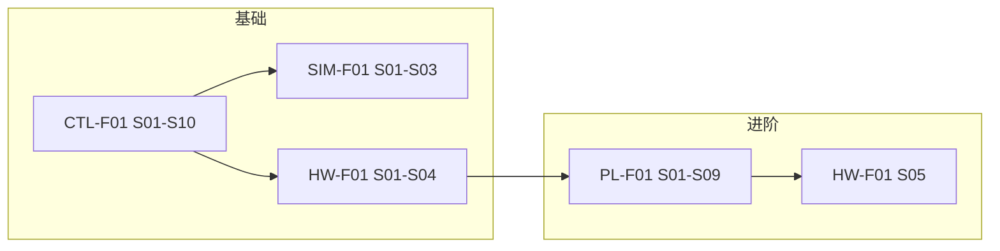

# 执行路线图 — 基础至进阶

## Meta
- **Status:** Approved（执行中）
- **Last updated:** 2026-07-06
- **Related:** [REQUIREMENTS_ANALYSIS](./REQUIREMENTS_ANALYSIS.md)

## TL;DR

**进度（2026-07-06）：** CTL-F01 Done · SIM-F01 核心 Done · **下一主线 HW-F01 上板** · PL-F01 未开始。

---

## 总览

---

## Phase 1 — 基础：顺序硬布线（CTL-F01）

| # | Slice | 交付 |
|---|-------|------|
| 1 | CTL-F01-S01 | 端口 + 模块骨架 |
| 2 | CTL-F01-S02 | W1 取指 |
| 3 | CTL-F01-S03 | ADD/SUB/AND/INC |
| 4 | CTL-F01-S04 | LD/ST |
| 5 | CTL-F01-S05 | JC/JZ/JMP |
| 6 | CTL-F01-S06 | STP |
| 7 | CTL-F01-S07 | 手动 SW |
| 8 | CTL-F01-S08 | OUT/DI/EI/IRET |
| 9 | CTL-F01-S09 | top 集成 |
| 10 | CTL-F01-S10 | 黄金表 + Feature Done |

**里程碑 M1：** ~~SIM 全指令向量 PASS~~ → **核心用例 PASS**（2026-07-06）

**下一执行：** Phase 3 **HW-F01-S01**（UCF 已存在）→ S02 ISE 工程 → S03 综合 → S04 上板

---

## Phase 2 — 仿真基础设施（SIM-F01）

| # | Slice | 可与 CTL 并行 |
|---|-------|---------------|
| 1 | SIM-F01-S01 | S01 后 |
| 2 | SIM-F01-S02 | S09 前完成套件 |
| 3 | SIM-F01-S03 | verify Stage 1 |

---

## Phase 3 — 上板（HW-F01 顺序版）

| # | Slice | 交付 |
|---|-------|------|
| 1 | HW-F01-S01 | tecplus.ucf |
| 2 | HW-F01-S02 | ISE 工程 |
| 3 | HW-F01-S03 | top.bit |
| 4 | HW-F01-S04 | 板上程序跑通 |

**里程碑 M2：** 基础层次可验收。

---

## Phase 4 — 进阶：流水线（PL-F01）

| # | Slice | 交付 |
|---|-------|------|
| 1 | PL-F01-S01 | 流水骨架 |
| 2 | PL-F01-S02 | 复用顺序译码 |
| 3 | PL-F01-S03 | IF 级 |
| 4 | PL-F01-S04 | EX 级 |
| 5 | PL-F01-S05 | MEM 级 |
| 6 | PL-F01-S06 | 数据冒险 |
| 7 | PL-F01-S07 | 控制冒险 |
| 8 | PL-F01-S08 | 性能报告 |
| 9 | PL-F01-S09 | 上板回归 |

---

## Phase 5 — 上板（HW-F01 流水版）

| # | Slice |
|---|-------|
| 1 | HW-F01-S05 |

**里程碑 M3：** 进阶层次可验收。

---

## 审批后首步

1. 将本文件与 REQUIREMENTS_ANALYSIS Status → **In Progress**（或保持 Review 直至你回复「批准」）
2. 执行 **CTL-F01-S01**（仅端口与骨架）
3. 更新 ACTIVE_WORK + PROGRESS_LOG

---

## 变更记录

| 日期 | 说明 |
|------|------|
| 2026-07-06 | M1 达成；下一主线 HW-F01 |
